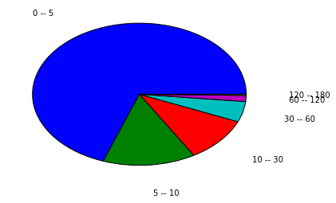
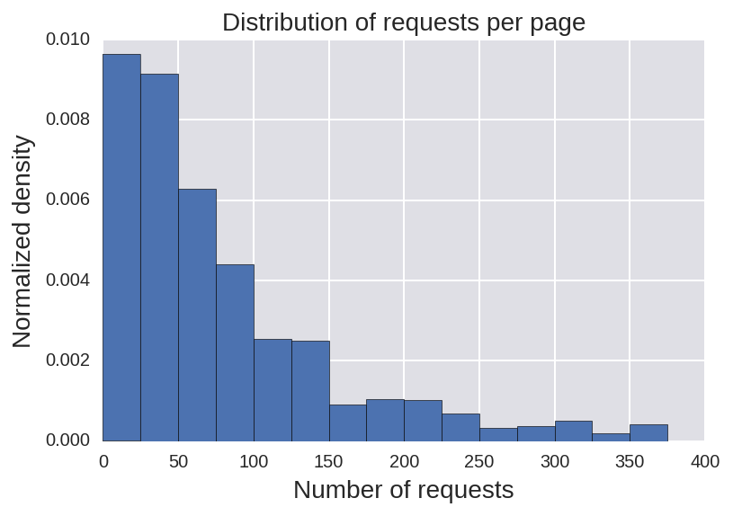
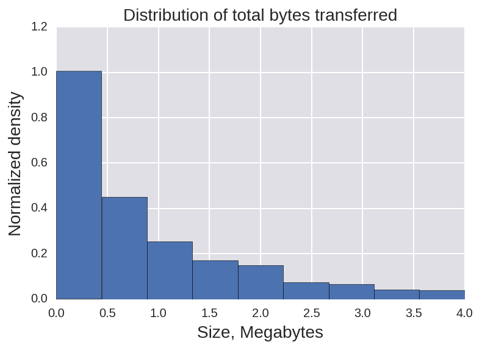
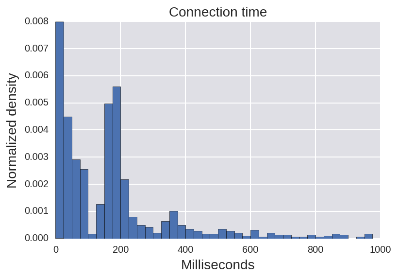
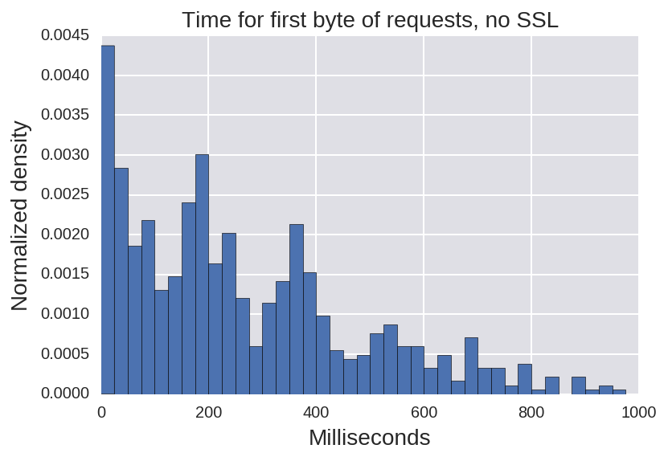
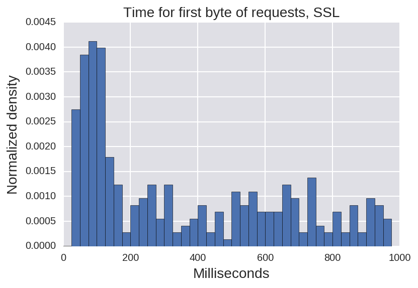
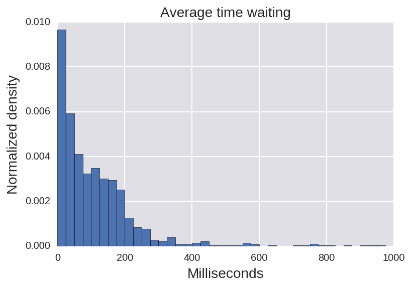
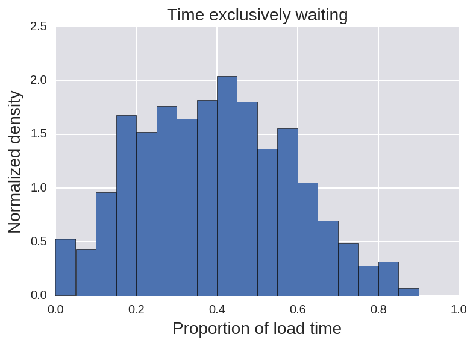

Data on cache and cache digest sizes
====================================

The more fundamental raw data about cache size can be found in the
`GitHub repository <https://github.com/shimmercat/internet_fonden_report>`
where this report lives.

The data with other statistics, from the third-subsection and onwards, is more bulky
and as such we haven't found a nice format to make it public.
On the other hand, the facts in section third and onwards are well known, and we
are just reinforcing the point.

Size of caches
--------------

Browsers organize their cache in different ways, and the data we show here
is concerned to only one browser, Mozilla Firefox.
However, we have read some of the source code that makes part
of  Google Chrome and we know that its cache is based in similar principles.

The basic message is that the average site, which is visited only sporadically
by a user, has very little content in cache.
We got that because we sampled a typical Firefox cache.
Here is in some more detail on how it looks.

In our data sample, the average number of cached assets per domain was between six
and seven.
But as shown in the pie chart below, that distribution was heavily tailed:

-  Almost 70% goes to domains that have between 0 and 5 assets in cache.
-  The next 15% contains domains that have between 5 and 10 assets in cache.
-  And the final, thinest slice goes to sites that have between 120 and
   180 assets in cache.

Sites that set a low number of assets in cache have either a low number of views from
the user (and thus the users's browser tends to not cache the contents), or perhaps more
typically, are service or sharding domains.

The last numbers on the other hand are more indicative of what is the typical number of
assets that a browser would need to hold in cache for a site, if that site was frequented
enough by the user for the browser to decide to include as many pieces of it in
cache as possible.

Here is the list of sites with biggest representations in cache and some
comentaries\ \_:

.. raw:: html

   <table border="1" class="dataframe">  <thead>    <tr style="text-align: right;">      <th></th>      <th>0</th>      <th>1</th>    </tr>  </thead>  <tbody>    <tr>      <th>0</th>      <td>164</td>      <td>apx.moatads.com</td>    </tr>    <tr>      <th>1</th>      <td>113</td>      <td>bonanzleimages.s3.amazonaws.com</td>    </tr>    <tr>      <th>2</th>      <td>76</td>      <td>cdn.salehoo.com</td>    </tr>    <tr>      <th>3</th>      <td>67</td>      <td>www.shimmercat.com</td>    </tr>    <tr>      <th>4</th>      <td>63</td>      <td>pagead2.googlesyndication.com</td>    </tr>    <tr>      <th>5</th>      <td>62</td>      <td>v4.moatads.com</td>    </tr>    <tr>      <th>6</th>      <td>57</td>      <td>www.salehoo.com</td>    </tr>    <tr>      <th>7</th>      <td>54</td>      <td>img0.etsystatic.com</td>    </tr>    <tr>      <th>8</th>      <td>52</td>      <td>srv-2016-06-27-11.pixel.parsely.com</td>    </tr>    <tr>      <th>9</th>      <td>52</td>      <td>img1.etsystatic.com</td>    </tr>  </tbody></table>

-  The first site in the list is an ads engine. So, if you ever wondered what was somebody thinking
   when you got to their website and saw ads rendered before main contents from the site, now you know
   that probably the ads that were following you from site to site  were cached right in your browser
   but the main contents of the website were not.
-  Other origins listed include CDN and media domains for a few sites. I visited some of those sites
   (etsy.com, salehoo.com) for first time the day that I collected the data, but some other sites
   (shimmercat.com) I visit regularly.

Also notice that big websites tend to split their assets over different domains due to
the performance practice called "domain sharding".

Implied size of cache digests
-----------------------------

How many bytes would be required for digests that comprehend 50 requests?
It depends on the  probability P of false positives used.
With P equal 1/32, one can assume an average bit length per asset in the digest not larger than one
byte.
By the numbers in the previous section, the largest digest wouldn't be longer than 167 bytes.
That's not a big amount, specially because those bytes can be sent at a time where the HTTP/2 connection
is mostly idle in the direction from browser to server.

Do we have reassurances that this numbers are typical enough? Yes, they follow
what others have found (see statcounter.com) and what a study
`done by ourselves showed <https://www.shimmercat.com/en/blog/articles/data-density/#-a-name-req-href-href-a-how-many-http-requests-per-page->`_
in January.

Data about web-page composition
------------------------------

Number of requests per page
^^^^^^^^^^^^^^^^^^^^^^^^^^^

- This is the distribution of the number of requests that are made to the server when fetching a page with
  an empty cache.
- The mean number is 86 requests.
- The 25% percentile falls in 26 requests
- The 75% percentile falls in 109 requests.

**Normalized density** is the height of the bar so that when you multiply it by its width, you get
the frequency that the bar represents.
For example, the first bar in the plot represents 0.0096 * 25 = 0.24, that is, 24% (which is not
far from our 25% percentile with 26 requests).

Amount of bytes transferred
^^^^^^^^^^^^^^^^^^^^^^^^^^^

- This is the sum of the transfer sizes for all the resources needed to assemble a page.
- For sites that enable some form of compression, the transfer size is the size of the compressed
  data.
- The mean number is 1.2 Mb (Mb=Megabytes).
- The lowest 25% uses 178 Kb or less.
- The biggest 25% uses more than 1.5 Mb.

Use of compression
^^^^^^^^^^^^^^^^^^

- We say that an asset is uncompressed if as far as we can say it was a missed opportunity for compression:
    - The uncompressed size of the asset is bigger than 2000 bytes and,
    - it has a mime type which is an obvious target for compression: `text/plain`, `text/html`, `text/css` or `application/javascript`, and
    - the `Content-Encoding` header field is not in the set: `gzip`, `deflate`, `compress`.
- In average, less than three resources per page were uncompressed.
- The worst 25% had two uncompressed resources or more.

Time spent by the browser setting up a connection
^^^^^^^^^^^^^^^^^^^^^^^^^^^^^^^^^^^^^^^^^^^^^^^^^

- This is the time that the browser needs to get the TCP socket ready.
- The mean time is 182 milliseconds.
- The best 25% falls below 32 milliseconds.
- The worst 25%, that is the 75% percentile, is above 202 milliseconds.

Notice that this time is
determined not so much by the browser but by how far is the server to which the browser
is trying to connect.

Time  before the browser sends the first byte of an HTTP request
^^^^^^^^^^^^^^^^^^^^^^^^^^^^^^^^^^^^^^^^^^^^^^^^^^^^^^^^^^^^^^^^

- Assume that the user pressed "ENTER" in his browser's interface.
  Also, assume that he or she has entered the direction correctly and
  therefore no redirects happen.
- The sub-sections below show how much time will pass before the browser can send the first
  byte of the first HTTP request.

Sites without SSL
""""""""""""""""""

- The browser needs to do a DNS lookup and a TCP connect.
- The mean time is 308 milliseconds.
- 25% of the sites manages to do it in less than 90 milliseconds.
- The 75% percentile falls at 405 milliseconds. In other words, the worst 25% uses 405 milliseconds
  or more.

Sites with SSL
""""""""""""""

- The browser needs to do a DNS lookup, a TCP connect, and a TLS handshake.
- The mean time to do all of this is 513 milliseconds.
- The best 25% manages in less than 50 milliseconds.
- The 75% percentile is at 969 milliseconds.
- The minimun in our dataset is 36 milliseconds.

Waiting time per request
^^^^^^^^^^^^^^^^^^^^^^^^

- This is the green portion of the "timing" bar in Google Chrome's dev-tools 
- We calculate the mean waiting time across all resources for each site, before the **onLoad** event fires. Therefore, we get one mean for each site in our data-set,
  and we do statistics over those.
- The mean mean (repetition intended) waiting time  is 119 milliseconds.
- The 25% percentile is at 26 milliseconds.
- The 75% percentile is at 156 milliseconds.

Now, this is the time waiting for a single request.
The browser does many requests concurrently.
So, even if the browser is waiting for one resource, it may be the case that is fetching
other resources and therefore network capacity is being used anyway.

Proportion of idle network time
^^^^^^^^^^^^^^^^^^^^^^^^^^^^^^^

- This is the proportion of the time from the start of the fetch until the load event where
  the browser is not receiving data for any request, but the browser has sent some requests
  and is waiting for their responses. That is, there are requests in flight even if no
  data is being received for them.
- Ideally, we want to lower that proportion as much as possible.
- The mean of that proportion is 0.39. That is, in average, a browser spends 39% of the time
  until the load event without receiving data.
- The 25% percentile was at 0.24. That is, the best quarter of sites managed to not-use
  the network 24% of the time or less.
- The 75% percentile was at 0.52. That is, the worst 25% of the sites in our sample was not
  receiving data half of the time or more.

- Notice that due to discovery, there may be segments of time before the load event where
  there is neither requests in flight nor data transfer. We didn't account for that time
  in this calculation.

The possible impact of effective HTTP/2 Push
--------------------------------------------

By the data above, HTGTP/2 Push would help sites to load in average 40% faster.
Therefore, we encourage any efforts to give this technique wider adoption.

In our conversations with web developers, one of the first objections is the
risk of pushing assets that the browser already has.
Cache digests is precisely  a way around this problem.
